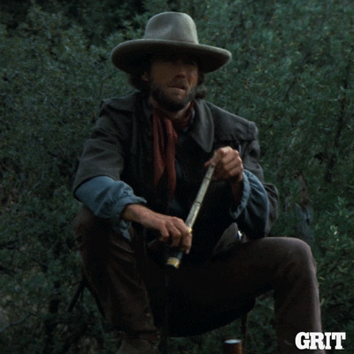

<h1 align="center">
  Salut ! Je m'appelle Alexis Chentre 👋
</h1>

<h3 align="center"> 
  Nombre de visites
  

  
</h3>

<h2 align="center">
  <i>
      D'où viens-je ?
  </i>
</h2>

  

  Originaire de Normandie, je suis venu en Loire-Atlantique en 2016 pour suivre une formation BTS pour dessinateur projeteur FTTH (Fiber To The Home). Ensuite, j'ai travaillé pendant 7 ans sur les études de conception dans les domaines des SIG (systèmes d'informations géographiques) et du GC (génie civil) pour les télécommunications en fibre optique.
   
  Déjà passionné par l'univers de l'IT (dans la découverte du fonctionnement et de la composition de réseaux, ainsi que de PC), et grâce à des contacts parmis des collègues et des amis développeurs, j'ai eu envie d'en savoir plus sur le monde de la tech. Je me suis alors mis en place une veille technique et j'ai finalement entrepris de suivre un nouveau cursus d'apprentissage, car ce qui me plaît dans la programmation, c'est de mettre en place des solutions face à des problèmes et d'apprendre continuellement sur de nouvelles technologies, méthodes et environnements de travail.
  

<h2 align="center">
  <i>
      Où vais-je ?
  </i>
</h2>

  

  Actuellement en formation de concepteur développeur d'applications, je passerais le titre RNCP de niveau 6 (équivalent Licence, Bac+3) en 2025 pour valider ce parcours de reconversion.
   
  Mais tout d'abord, je dois trouver une alternance d'un an - celle-ci pouvant débuter entre mars et mai 2024 - en tant que développeur logiciel ou fullstack, idéalement dans l'open source.
   
  Par la suite, avec un peu plus d'expérience, je pense bien me lancer dans du indie hacking pour du développement de SAAS, ou peut-être poursuivre ma carrière sur du freelancing.

<h2 align="center">
  <i>
      Mobilité
  </i>
</h2>

  

  J'habite actuellement à Plessé en Loire-Atlantique, et je suis ouvert à toute opportunité sur le reste de la France.

<h2 align="center">
  <i>
      Mes stacks
  </i>
</h2>

 
  
  
  
  
  
  
  
  
  
  
  
  
  

<h2 align="center">
  <i>
      Mes statistiques
  </i>
</h2>

   

  

<h2 align="center">
  <i>
    Où me trouver sur les réseaux
  </i>
</h2>

  

